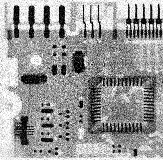
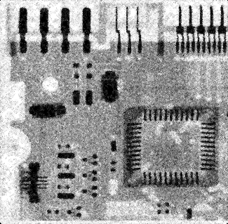
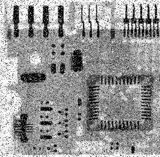
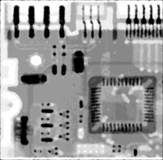
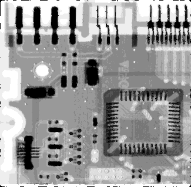
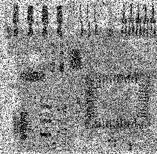
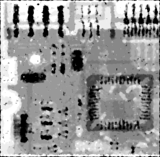
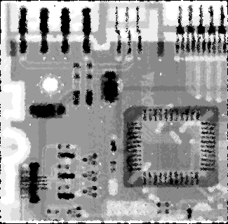

# 吴禹 2023214309 实验2

## image文件夹存放原始图片

## output文件夹存放处理后的图片

## filter.py

* 函数
  * alpha_trimmed_mean_filter 修正的阿尔法均值滤波器
  * 参数
    * m,n 窗口大小
    * d 首位截取大小
  * adaptive_median_filter 自适应中值滤波器
  * 参数
    * s0 窗口初始大小
    * smax 最大窗口
* 结果
  * 原图（A_Gauss.bmp）

  

  * 使用修正的阿尔法均值滤波器（m=5, n=5, d=2）

  

  * 使用自适应中值滤波器（s0=3, smax=7）

  

  * 原图（A_SP_05.bmp）

  

  * 使用修正的阿尔法均值滤波器（m=5, n=5, d=5）

  

  * 使用自适应中值滤波器（s0=3, smax=7）

  

  * 原图（A_SP_1.bmp）

  

  * 使用修正的阿尔法均值滤波器（m=5, n=5, d=10）

  

  * 使用自适应中值滤波器（s0=3, smax=7）

  

  * 原图（A_SP_2.bmp）

  

  * 使用修正的阿尔法均值滤波器（m=5, n=5, d=15）

  

  * 使用自适应中值滤波器（s0=3, smax=7）

  

  * 原图（A_SP_5.bmp）

  

  * 使用修正的阿尔法均值滤波器（m=5, n=5, d=20）

  

  * 使用自适应中值滤波器（s0=3, smax=7）

  
  