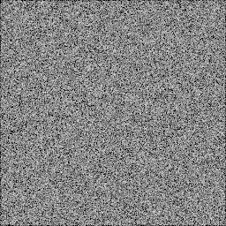
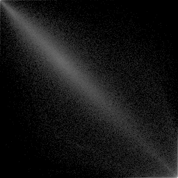

# 吴禹 2023214309 实验4

## image文件夹存放原始图片

## output文件夹存放处理后的图片

## matrix.py

- 函数
  - symbiotic_matrix 计算共生矩阵，并且返回描绘子指标
  - invariant_moment 计算不变矩
  - compute_m_pq 计算$m_{pq}$
  - compute_mu_pq 计算$\mu_{pq}$
  - compute_eta_pq 计算$\eta_{pq}$

## 实验结果

### 实验第一部分：计算共生矩阵并且计算描绘子

- 原图（G1.bmp)

- 共生矩阵可视化结果

- 原图（G2.bmp）

- 共生矩阵可视化结果

- 原图（G3.bmp）

- 共生矩阵可视化结果（使用了log函数平衡数量差异过大）

* 三张图的描绘子表格

| 标准化的共生矩阵 | 最大概率 |   相关   |   对比度   |一致性|同质性|熵|
| :-------: | :----: | :---: | :---: | :---: | :---: | :---: |
| G1 | 0.0000571056 | -0.0004731710 | 10838.3116823783 | 0.0000200938 | 0.0366051703 | 15.7426148110 |
| G2 | 0.0150187735 | 0.9649755572 | 569.8735919900 | 0.0123480383 | 0.0823617007 | 6.4294310435 |
| G3 | 0.0589424994 | 0.9042751199 | 1044.0752747018 | 0.0035953970 | 0.2004951338 | 13.6254661196 |

### 实验第二部分：计算不变矩

- 原图（M1.bmp）

- 平移（M2.bmp）

- 缩小一半（M3.bmp）

- 镜像（M4.bmp）

- 旋转45°（M5.bmp）

- 旋转90°（M6.bmp）

- 6张图的不变矩表格

|  不变矩  |     原图像     |      平移      |    缩小一半    |      镜像      |    旋转45°     |    旋转90°     |
| :------: | :------------: | :------------: | :------------: | :------------: | :------------: | :------------: |
| $\phi_1$ | -2.8661553340  | -2.8661553340  | -2.8664089919  | -2.8661553340  | -2.8661408298  | -2.8661553340  |
| $\phi_2$ | -7.1265385806  | -7.1265385806  | -7.1257194636  | -7.1265385806  | -7.1266226459  | -7.1265385806  |
| $\phi_3$ | -10.4109289799 | -10.4109289799 | -10.4047335930 | -10.4109289799 | -10.4114536906 | -10.4109289799 |
| $\phi_4$ | -10.3742310361 | -10.3742310361 | -10.3719441905 | -10.3742310361 | -10.3742191656 | -10.3742310361 |
| $\phi_5$ | -21.3673706509 | -21.3673706509 | -21.3923704488 | -21.367370650  | -21.3662813752 | -21.3673706509 |
| $\phi_6$ | -13.9416868527 | -13.9416868527 | -13.9383087319 | -13.9416868527 | -13.9417447207 | -13.9416868527 |
| $\phi_7$ | 21.4870418211  | 21.4870418211  | 21.5212010394  | 21.1204479126  | -20.6262348142 | -20.8413730008 |

