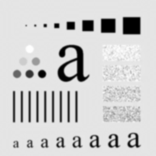

# 吴禹 2023214309 作业4

## image文件夹存放原始图片

## output文件夹存放处理后的图片

## fourier_transformation.py

* 函数
  * fourier_transformation 二维离散傅里叶变换
  * inverse_fourier_transformation 二维离散傅里叶逆变换
* 结果
  * 原图（Lena.png）

  

  * 二维离散傅里叶变换

  

  * 二维离散傅里叶逆变换

  

  * 原图（Sample.png）  

  

  * 二维离散傅里叶变换

  

  * 二维离散傅里叶逆变换

  

  * 傅里叶变换且做平移处理后，图片靠近中心的部位是高频部分，远离中心的部位是低频部分

  * 傅里叶逆变换后可以看到与原图片没有明显差异

## lowpass_filtering.py

* 函数
  * ideal_lowpass_filtering 理想低通滤波
  * gaussian_lowpass_filtering 高斯低通滤波
* 结果
  * 原图（Sample.png）

  

  * d0=10，ideal_lowpass_filtering

  

  * d0=20，ideal_lowpass_filtering

  

  * d0=40，ideal_lowpass_filtering

  

  * d0=10，gaussian_lowpass_filtering

  

  * d0=20，gaussian_lowpass_filtering

  

  * d0=40，gaussian_lowpass_filtering

  
