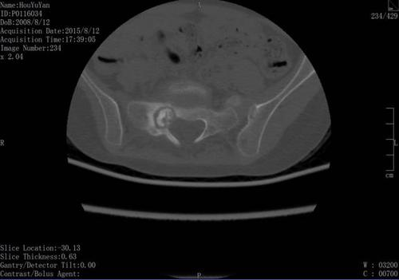
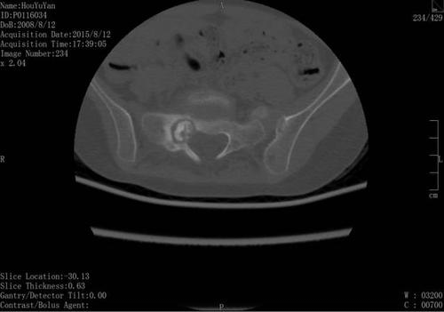

# 吴禹 2023214309 作业5

## image文件夹存放原始图片

## output文件夹存放处理后的图片

* 函数

  * homomorphic_filtering 同态滤波

* 结果

  * 原图（A.bmp）

  

  * 灰度图

  

  * 同态滤波后的图片

  

  * 原图（B.bmp）

  

  * 灰度图

  

  * 同态滤波后的图片

  

  * 原图（C.bmp）

  

  * 灰度图

  

  * 同态滤波后的图片

  

  * 原图（D.bmp）

  

  * 灰度图

  

  * 同态滤波后的图片

  

* 实验结果分析  

假如图像照明不均，则图像上各部分的平均亮度会有起伏。对应于暗区的图像细节结构就较难分辨，需要消除这种不均匀性。可以压缩照明函数的灰度范围，也就是在频域上削弱照明函数的成分，同时增强反射函数的频谱成分，就可以增加反映图像对比度的反射函数的对比度。结果，使图像上暗区图像细节得以增大，并尽可能大的保持亮区的图像细节。
