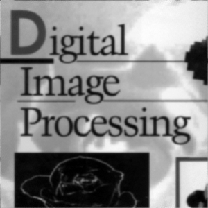

# 吴禹 2023214309 作业6

## image文件夹存放原始图片

## output文件夹存放处理后的图片

## degrade.py

* 函数
  * atmospheric_turbulence_model 大气湍流模型
  * motion_model 运动模糊模型
* 结果
  * 原图（DIP.png）

  

  * 使用大气湍流模型进行图像退化

  

  * 使用运动模糊模型进行图像退化

  

## reconstruct.py

* 函数
  * gaussian_noise 添加高斯噪音
  * optimum_notch_filtering 最佳陷波滤波（使用理想带通滤波器）
  * wiener_filtering 维纳滤波
* 结果
  * 原图（output\img_DIP_at.png）

  

  * 添加高斯噪音后

  

  * 与原图的像素差异

  

  * 进行最佳陷波滤波过滤后

  

  * 与添加高斯噪音的图片的像素差异

  

  * 进行维纳滤波过滤后

  

  * 与添加高斯噪音的图片的像素差异

  
  