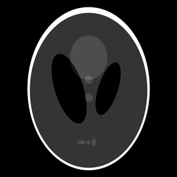
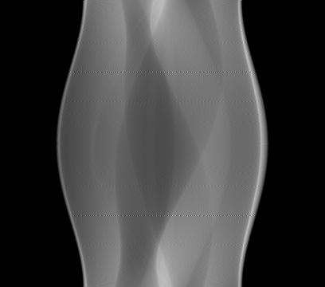
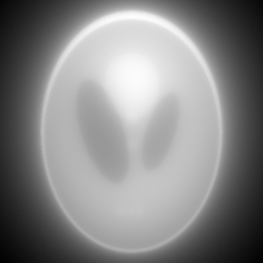
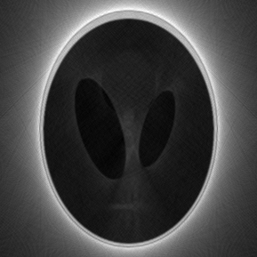

# 吴禹 2023214309 作业7

## image文件夹存放原始图片

## output文件夹存放处理后的图片

## projection.py

* 函数
  * projection() 使用雷登变换进行投影
  * back_projection() 直接反投影
  * parallel_beam_filtered_back_projection() 使用平行射线束滤波反投影
* 结果
  * 原图（shepp-logan.png）

  

  * 投影后的正弦图

  

  * 直接反投影获得重构的原图

  

  可以看到，整个图片轮廓边缘有着不正确的光影效果

  * 使用平行射线束滤波反投影

  

  使用正确的推导出来的计算公式后，整个图像没有了之前模糊的现象，但是还是存在灰度处于中间的像素点没有办法区分开的情况
  